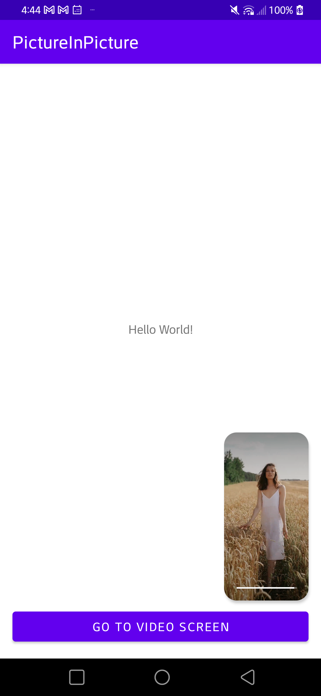

# PictureInPicture

This application is a simple picture in picture example

## Reference github repo
- https://github.com/tfaki/PictureInPicture

## Screen capture

<table style="padding:10px">
	<tr>
		<td align="center">
			<h2>Main Activity</h2>
		</td>
		<td align="center">
			<h2>Main Activity with Picture In Picture Mode</h2>
		</td>
  	</tr>
	<tr>
    	<td align="center">
			
    	</td>
		<td align="center">
			
    	</td>
  	</tr>
</table>

## Screen Record
https://user-images.githubusercontent.com/37421570/195594011-d52ef03d-d44b-405c-80bd-e297f70649c5.mp4
