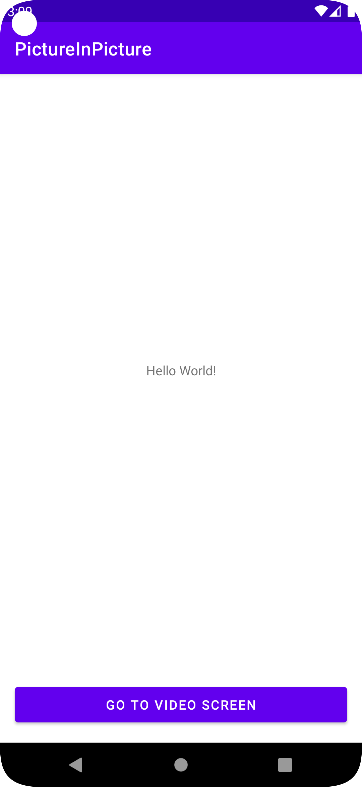

# PictureInPicture

This application is a simple picture in picture example


## Setup Webview URL
- path: android-pip/app/src/main/java/com/android/pictureinpicture/VideoActivity.kt

	```kotlin
	override fun onCreate(savedInstanceState: Bundle?) {
			...
      webView = findViewById(R.id.webView)
      // Load web page in WebView
      webView.webViewClient = WebViewClient()
      this.setupWebView()
      webView.loadUrl("https://dev-player.charlla.io/shoplayer/list/QFuoEZxk1AJ?l=grid&mini=true")
  }
	```

## Picture In Picture
- `VideoActivity.kt`
  ```kotlin
	import android.app.PictureInPictureParams
	....
	private var pictureInPictureParamsBuilder:PictureInPictureParams.Builder? = null
	...

	override fun onCreate(savedInstanceState: Bundle?) {
				...
        //init PictureInPictureParams, requires Android O and above
        if (Build.VERSION.SDK_INT >= Build.VERSION_CODES.O){
            pictureInPictureParamsBuilder = PictureInPictureParams.Builder()
        }
        ...
    }

	private fun pictureInPictureMode(){
        //Requires Android O and higher
        Log.d(TAG, "pictureInPictureMode: Try to enter in PIP mode")
        if (Build.VERSION.SDK_INT >= Build.VERSION_CODES.O){
            Log.d(TAG, "pictureInPictureMode: Supports PIP")
            //setup PIP height width
            val aspectRatio = Rational(webView.width, webView.height)
            pictureInPictureParamsBuilder!!.setAspectRatio(aspectRatio).build()
            enterPictureInPictureMode(pictureInPictureParamsBuilder!!.build())
        }
        else{
            Log.d(TAG, "pictureInPictureMode: Doesn't supports PIP")
            Toast.makeText(this, "Your device doesn't supports PIP", Toast.LENGTH_LONG).show()
        }
    }

	override fun onPictureInPictureModeChanged(
        isInPictureInPictureMode: Boolean,
        newConfig: Configuration?
    ) {
        super.onPictureInPictureModeChanged(isInPictureInPictureMode, newConfig)
        if (isInPictureInPictureMode){
            Log.d(TAG, "onPictureInPictureModeChanged: Entered PIP")
        }
        else{
            Log.d(TAG, "onPictureInPictureModeChanged: Exited PIP")
        }
    }
	```

## Screen capture

<table style="padding:10px">
	<tr>
		<td align="center">
			<h2>Main Activity</h2>
		</td>
		<td align="center">
			<h2>Main Activity with Picture In Picture Mode</h2>
		</td>
  	</tr>
	<tr>
    <td align="center">
			
    	</td>
		<td align="center">
			
    </td>
  	</tr>
</table>

## Reference github repo
- https://github.com/tfaki/PictureInPicture
